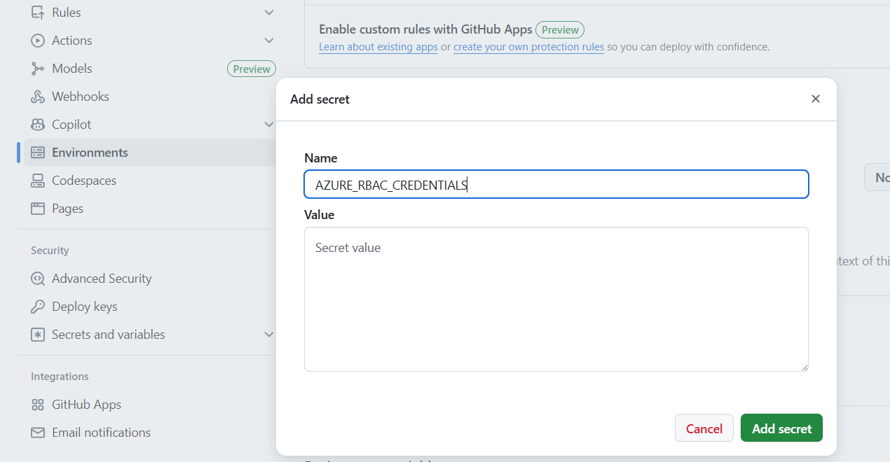

# Automated IP Restriction Updates for Azure Logic Apps

This solution leverages **Azure Functions** to automatically update the **allowed IP address lists** for **Azure Logic Apps**, based on the latest **Azure service tags**. It ensures that Logic Apps remain securely accessible only to trusted Azure services, even as IP ranges evolve.


## Key Components

1. Daily Trigger Function

    A time-triggered Azure Function runs on a daily schedule. It queries Azure Resource Graph to identify all Logic Apps tagged with:
    ```
    update-allowed-ip-ranges = automatic
    ```
    For each matching Logic App, it places a message into an Azure Storage Queue, signaling that an IP update is required. This is the resource graph query used to find the Logic Apps:

    ```kusto
    resources
    | where type == 'microsoft.logic/workflows'
    | where tags['update-allowed-ip-ranges'] == 'automatic'
    | project name, location, resourceGroup, subscriptionId, tags
    ```

2. Queue-Triggered Update Function

   A second Azure Function, triggered by the queue message, performs the following:
   - Retrieves the latest IP ranges for a specified Azure service tag (e.g., Dynamics365) and region using the Network Management Service Tags API.
   - Updates the Logic App’s access control configuration with the new IP ranges, ensuring only current, valid addresses are allowed.


## Benefits

- **Automated Compliance**: Ensures Logic Apps stay aligned with the latest Microsoft IP ranges.
- **Scalable & Tag-Driven**: Easily extendable to multiple Logic Apps using simple tagging.
- **Secure by Design**: Reduces risk of outdated IP allowlists and unauthorized access.


## Deployment

### Step 1. Setup Azure resources

To create Azure resources, you can use the provided `scripts/create-azure-env.sh` file. Copy `template.env` to a new file named `.env` and customize the settings according to your environment.
After this customization, just run the provided file in the `scripts` directory:

```bash
./create-azure-env.sh
```

In the end you should have the following resources created:


### Step 2. Deploy function app to Azure using GitHub Actions

Use the provided GitHub Action workflow file `.github/workflows/azure-deploy.yml` that deploys the Function app in your environment.

#### 2.1. Create a Service principal to deploy Function app and configure Secrets in GitHub

Run the provided script `scripts/prep-github-actions.sh` to create a Service Principal. The command should output a JSON object similar to this:

```json
  {
    "clientId": "<GUID>",
    "clientSecret": "<GUID>",
    "subscriptionId": "<GUID>",
    "tenantId": "<GUID>",
    (...)
  }
```
Copy and paste the json response from above Azure CLI to your GitHub Repository > Settings > Secrets > Actions > Manage Environment secrets > Choose Environment `dev` > Environment secrets > Add environment secret > `AZURE_RBAC_CREDENTIALS`.




#### 2.2. Customize GitHub Action

In the GitHub Action workflow file, you can change these variables for your configuration:

| Variable               | Value         | Description                                  |
| ---------------------- | ------------- | -------------------------------------------- |
| AZURE_FUNCTIONAPP_NAME | your-app-name | Set this to your function app name on Azure. |


#### 2.3. Commit and push your project to GitHub repository

You should see a new GitHub workflow initiated in Actions tab.


### Step 3. Assign roles and permissions to Function app

Function app system assigned identity needs to have the following roles to be able to execute certain operations in other Azure resources. If you use the provided script `scripts\create-azure-env.sh` these roles are already assigned:

| Role                           | Azure resource               | Notes |
| ------------------------------ | ---------------------------- | ----- |
| Storage Blob Data Owner        | Storage Account              | For blobs |
| Storage Queue Data Contributor | Storage Account              | For queues |
| Contributor                    | Subscription level or resource group | Where the Logic Apps (tagged for automatic ip ranges update) reside. |

### Step 4. Configure Function App environment settings

Adjust these settings in your Function app environment:

| Key                                              | Value                                         | Description                                                    |
| ------------------------------------------------ | --------------------------------------------- | -------------------------------------------------------------- |
| AzureWebJobsStorage                              | Storage Account connection string             | Used by the Function App to store data and use queues.         |
| ALLOWED_IP_RANGES_UPDATE_TYPE                    | Choose one of these values `replace` or `merge` | Choose one to define the update behavior for allowed IP ranges. In case of `replace`, the existing IP ranges will be replaced with the new ones. In case of `merge`, the new IP ranges will be added to the existing ones, without duplicates. If not specified, `merge` is the default behaviour. |

You can go directly to Azure Portal, or you can use Azure CLI to set these settings:

```bash
# Example
az functionapp config appsettings set --name <function-app-name> --resource-group <resource-group-name> --settings KEY1="value1" KEY2="value2"
```

If you used the provided script `scripts/create-azure-env.sh`, these settings are already set in your Function app environment.


## Deploy test Logic Apps

You can deploy two test Logic Apps using the provided script `scripts/deploy-test-logic-apps.sh`. This script will create two new Logic Apps in the specified resource group and location. You can customize the Logic App name in the script. After running the script, it will output the HTTP trigger URL for the Logic App.

curl -X POST "https://prod-14.swedencentral.logic.azure.com:443/workflows/ab6d71d4eb124c96aba72d131ba0d2a8/triggers/manual/paths/invoke?api-version=2016-10-01&sp=%2Ftriggers%2Fmanual%2Frun&sv=1.0&sig=LLsCEpdp3rRXZaKR-4svwz6k4iuFI6C4ZJ4ywxHMo5M" -H "Content-Type: application/json" -d '{"message": "Hello from curl!"}'


## Development

You can check the guidelines for development in the [DEVELOPMENT](docs/development.md).

