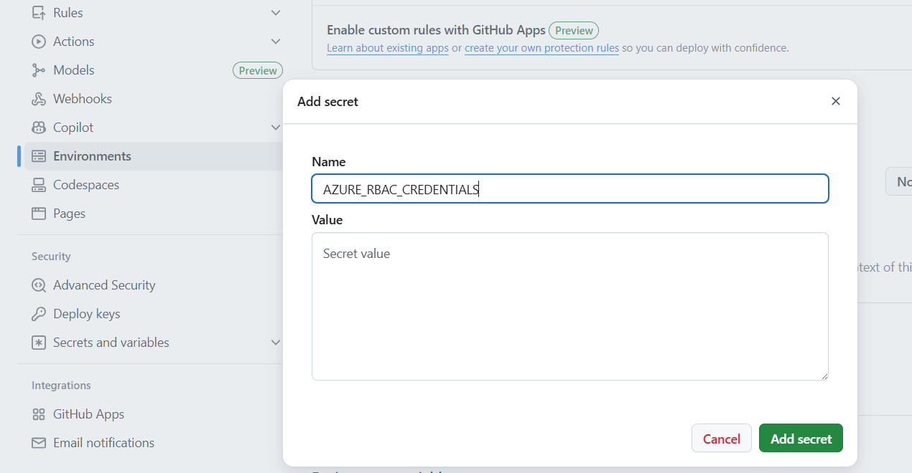
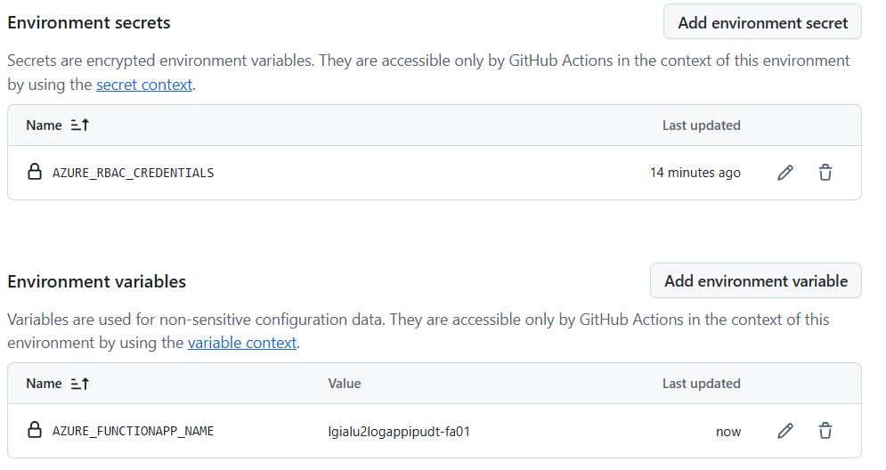
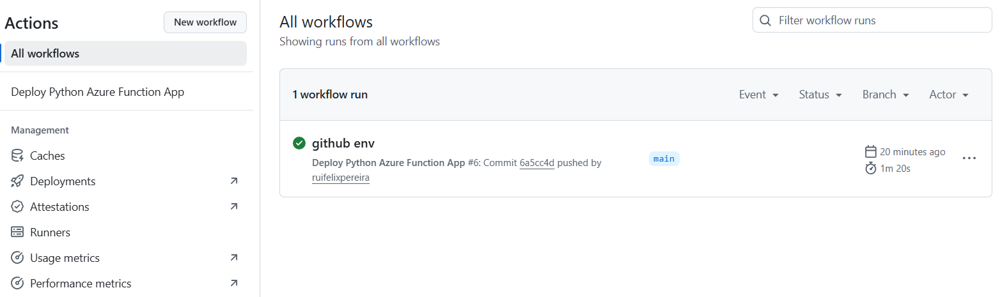
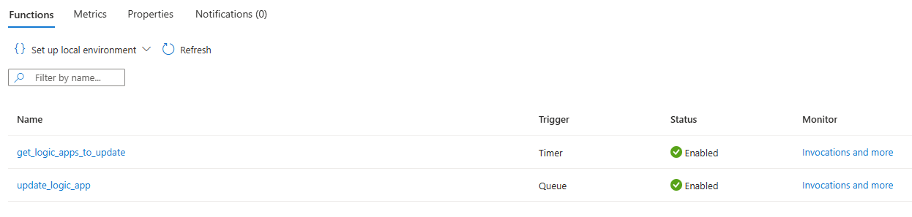

# Automated Deployment using GitHub Actions

This solution leverages **GitHub Actions** to automate the deployment of the **Function App** to **Azure**. You can use the provided GitHub Action workflow file `.github/workflows/azure-deploy.yml` that deploys the Function app in your environment.

## Step 1. Create a Service principal to deploy Function app and configure Secrets in GitHub

Run the provided script `scripts/prep-github-actions.sh` to create a Service Principal. The command should output a JSON object similar to this:

```json
  {
    "clientId": "<GUID>",
    "clientSecret": "<GUID>",
    "subscriptionId": "<GUID>",
    "tenantId": "<GUID>",
    (...)
  }
```
Copy and paste the json response from above Azure CLI to your GitHub Repository > Settings > Secrets and variables > Actions > Manage Environment secrets > Choose Environment `dev` > Environment secrets > Add environment secret > `AZURE_RBAC_CREDENTIALS`.




## Step 2.Configure Function App name

In your GitHub Repository add a new variable by navigating to Settings > Secrets and variables > Actions > Change to Variables tab > Choose Environment `dev` > New repository variable > `AZURE_FUNCTIONAPP_NAME`.

| Variable               | Value         | Description                                  |
| ---------------------- | ------------- | -------------------------------------------- |
| AZURE_FUNCTIONAPP_NAME | your-app-name | Set this to your function app name on Azure. |

After these steps you will have the following secrets and variables configured in your GitHub repository:




## Step 3. Commit and push your project to GitHub repository

If you push your changes to GitHub, the GitHub Action workflow will be triggered automatically. You can monitor the progress of the deployment in the Actions tab of your GitHub repository.



## Step 4. Check you Function App in Azure

In the Azure Portal you can check the Function App functions that were deployed and are ready to use:


